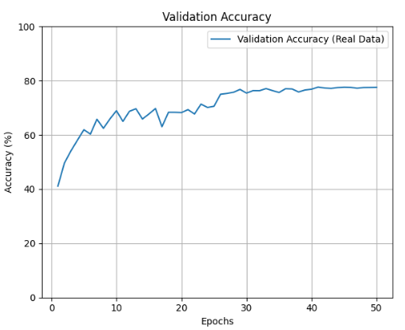

# Re-implementation of Knowledge Distillation with Synthetic Data (DM-KD)

This repository contains a PyTorch-based re-implementation of core concepts from the paper "Is Synthetic Data From Diffusion Models Ready for Knowledge Distillation?" (DM-KD). The primary goal is to validate the principle that a student model can be effectively trained for image classification using only synthetically generated images, guided by a knowledgeable teacher model.

This project currently focuses on experiments with the CIFAR-10 dataset.

## Project Overview

The core pipeline implemented is as follows:
1.  **Teacher Model Preparation:** A teacher model (ResNet18) is first fine-tuned on the *real* CIFAR-10 training dataset to make it an expert for this specific domain.
2.  **Synthetic Data:** We utilize the CIFAKE dataset (specifically, the AI-generated "FAKE" images that mirror CIFAR-10 classes) as the *only* training data for our student model.
3.  **Knowledge Distillation (KD):** A student model (ResNet18, randomly initialized) is trained to mimic the softened output distributions (soft labels) of the fine-tuned teacher model on the synthetic CIFAKE images. The loss function used is Kullback-Leibler (KL) Divergence.
4.  **Evaluation:** The trained student model is evaluated on the *real* CIFAR-10 test dataset to assess its generalization capability.

## Current Results (CIFAR-10)

-   **Setup:**
    -   Synthetic Training Data: CIFAKE (50,000 AI-generated images for 10 CIFAR-10 classes, Stable Diffusion v1.4).
    -   Teacher Model: ResNet18 (ImageNet pre-trained, then fine-tuned on real CIFAR-10 for 15 epochs, achieving 87.08% accuracy on real CIFAR-10 test set.
    -   Student Model: ResNet18 (randomly initialized).
    -   KD Temperature: 10.0
    -   Epochs for Student Training: 50
    -   Optimizer: SGD (lr=0.05, momentum=0.9, weight_decay=5e-4)
    -   LR Scheduler: MultiStepLR (decay at epochs 25, 40 by gamma=0.1)

-   **Key Findings:**
    -   **Impact of Teacher Fine-tuning:**
        -   Initially, using an ImageNet pre-trained ResNet18 (with only the final layer adapted for CIFAR-10) as the teacher resulted in poor student performance on the real CIFAR-10 test set (validation accuracy stagnating around 6-9%). This indicated that the teacher's knowledge, while broad, was not sufficiently specialized for the CIFAR-10 distribution to effectively guide the student via synthetic data.
        -   After fine-tuning this ImageNet teacher on the *real CIFAR-10 training data*, the student model trained via KD on synthetic data showed a **dramatic improvement**.
    -   **Student Performance:** The student model, trained solely on synthetic CIFAKE images under the guidance of the fine-tuned teacher, achieved a **best validation accuracy of 77.66%** on the real CIFAR-10 test set after 50 epochs.
    -   **Demonstration of DM-KD:** This result successfully demonstrates the core principle of the DM-KD paper: effective knowledge transfer is possible using only synthetic data, provided the teacher is a strong expert on the target domain.

#### The graphs below showcase the Training Progress:




## Running the Code

1.  **Clone the repository:**
    ```bash
    git clone [Your GitHub Repo URL]
    cd DM-KD_PyTorch_Implementation
    ```
2.  **Set up environment and install dependencies:**
    ```bash
    python -m venv venv
    source venv/bin/activate # or venv\Scripts\activate on Windows
    pip install -r requirements.txt
    ```
3.  **Download Data:**
    *   The real CIFAR-10 dataset will be downloaded automatically by PyTorch.
    *   Download the CIFAKE dataset from [Kaggle](https://www.kaggle.com/datasets/birdy654/cifake-real-and-ai-generated-synthetic-images). Extract the `train/FAKE` images and place them into a directory like `synthetic_data/cifake_train_fake/` (or adjust paths in the scripts).
4.  **Fine-tune the Teacher Model:**
    ```bash
    python fine_tune_teacher_cifar10.py --epochs 15 --lr 0.001 --batch_size 128 
    ```
    (This will save `teacher_cifar10_finetuned.pth`)
5.  **Train the Student Model using KD:**
    ```bash
    python main_train_cifar10.py --epochs 50 --lr 0.05 --batch_size 128 --teacher_weights teacher_cifar10_finetuned.pth
    ```

## Future Goals

-   Extend experiments to the ImageNet-1K dataset using available synthetic ImageNet data at [Kaggle](https://www.kaggle.com/datasets/vitaliykinakh/stable-imagenet1k).
-   Investigate the impact of different teacher/student model architectures and capacities.
-   Explore the DM-KD paper's findings regarding synthetic image fidelity if suitable datasets can be found or generated.

## Acknowledgements

-   This work is a re-implementation based on the principles from "Is Synthetic Data From Diffusion Models Ready for Knowledge Distillation?" by Li et al.
-   CIFAKE dataset by Bird, J.J., Lotfi, A. (2024).

